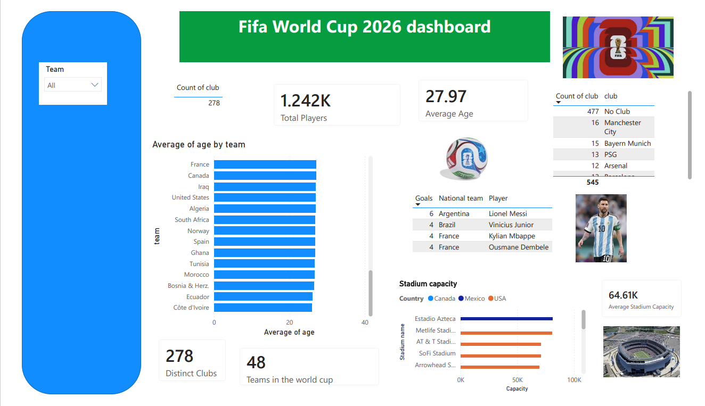

# Fifa World Cup
A summary dashboard for the world cup taking place in USA, Canada and Mexico. This dashboard includes some of the key metrics and statistics associated with the world cup

### Project Overview

- The goal of the project is to track, monitor and analyse the different data assocated with the Fifa world cup.

 

---

#### Business Objecitves:

##### The objective of this dashboard is to provide a snap shot summary of some of the key metrics and statistics associated with the Fifa World cup. These include:

- Monitor KPIs in real time 
- Identify high-performing players, that have scored the most goals
- Identify the average age of the different teams at the world
- Identify the different clubs which have the highest representation at the world cup
- Identify the different stadium capacity and the average stadium capacity for all the venues at the world cup
  
###### The dashboard should allow users to dynamically filter data by:

- Each team/country

 

---

#### Tools
- Power Bi
- Power Query
- Dax
- Excel
- SQL
- Python

 

---

#### Key Metrics
Main KPIs
- Top goal scorer
- Average age per team/country

 

---

#### Insights
- Lionel Messi is currently leading the goalscoring charts after the group stage of the World Cup.
- Panama is the country with the highest average age, and Cote d'Ivoire have the lowest average.
- Aside from players without a club, Man City is the most represented club at the tournament
- The average stadium capacity for the tournamet is 64.61k with the Estadio Azteca having the highest capacity
- 278 distinct clubs are represented by players at the world cup
- There are 1242 players at the world cup at a combined average age of 27.97 

 

---

#### PowerBI-Fifa World Cup

